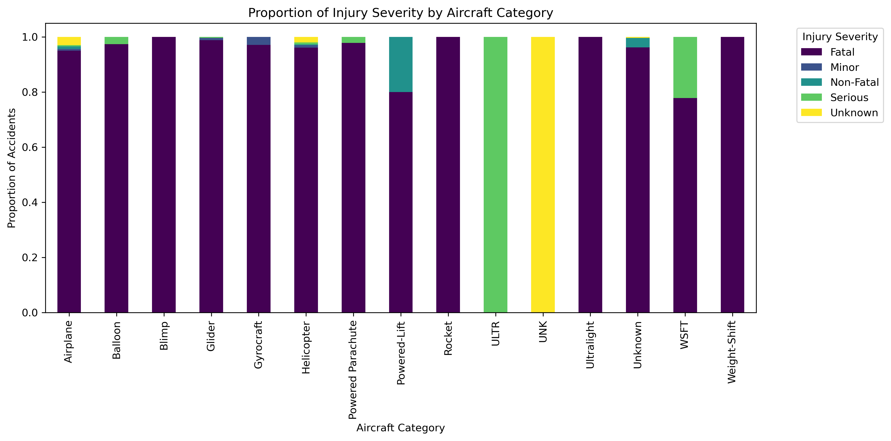
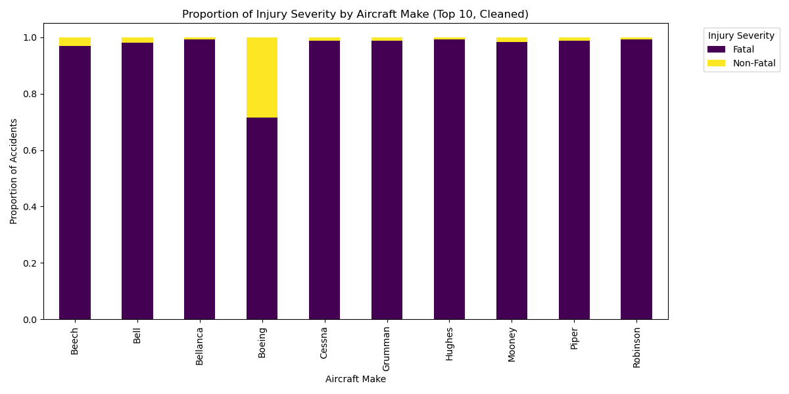
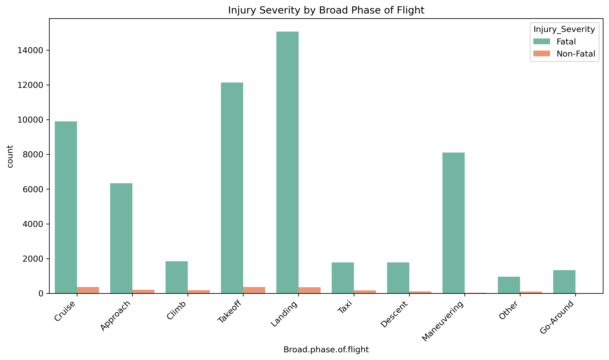

# Aviation Accidents and Incidents Data Analysis

## Overview
This project analyzes historical aviation accidents and incidents data (1962–2023) to provide **actionable insights** for safer aircraft purchase decisions. The analysis focuses on identifying lower-risk aircraft categories, safer makes and models, and key contextual factors affecting accident severity.

---

## Business Understanding
The company is launching a new aviation venture. The key business questions include:

- Which aircraft categories have lower accident severity?
- Which aircraft makes and models are associated with safer operations?
- How do weather, flight purpose, and phases of flight impact accident severity?

The goal is to support **data-driven aircraft purchase decisions** for safer and more cost-effective operations.

---

## Data Understanding and Analysis

**Source of Data:** [Kaggle - Aviation Accidents and Incidents Dataset](https://www.kaggle.com/)  

### Data Understanding and Description

**Source of Data:** Kaggle – Aviation Accidents and Incidents Dataset  

**Dataset Description:**  
The dataset contains **90,348 records** and **31 columns** of aviation accidents and incidents from various sources. It includes a wide range of information about each event, including aircraft type, flight purpose, injury severity, location, and operational context.

**Columns and Key Information:**  

| Column                     | Non-Null Count | Data Type | Description |
|----------------------------|---------------|-----------|-------------|
| Event.Id                   | 88,889        | object    | Unique identifier for the event |
| Investigation.Type         | 90,348        | object    | Type of investigation (Accident/Incident) |
| Accident.Number            | 88,889        | object    | Official accident number |
| Event.Date                 | 88,889        | object    | Date of the event |
| Location                   | 88,837        | object    | Event location |
| Country                    | 88,663        | object    | Country where event occurred |
| Latitude                   | 34,382        | object    | Latitude of event location |
| Longitude                  | 34,373        | object    | Longitude of event location |
| Airport.Code               | 50,132        | object    | ICAO/IATA code of airport, if applicable |
| Airport.Name               | 52,704        | object    | Name of airport, if applicable |
| Injury.Severity            | 87,889        | object    | Severity of injuries (Fatal, Serious, Minor, Uninjured) |
| Aircraft.damage            | 85,695        | object    | Level of aircraft damage |
| Aircraft.Category          | 32,287        | object    | Aircraft category (Airplane, Helicopter, Ultralight, etc.) |
| Registration.Number        | 87,507        | object    | Aircraft registration |
| Make                       | 88,826        | object    | Aircraft manufacturer |
| Model                      | 88,797        | object    | Aircraft model |
| Amateur.Built              | 88,787        | object    | Whether aircraft is amateur-built |
| Number.of.Engines          | 82,805        | float64   | Number of engines on aircraft |
| Engine.Type                | 81,793        | object    | Type of engine(s) |
| FAR.Description            | 32,023        | object    | Regulatory description applicable |
| Report.Status              | 82,505        | object    | Status of the report |
| Publication.Date           | 73,659        | object    | Date report was published |

> **Note:** Some columns have missing values, especially geolocation (Latitude/Longitude), aircraft category, and airport information. This dataset provides a comprehensive view of aviation accidents worldwide, but cleaning and preprocessing are required for accurate analysis.

---

## Dashboard

Below are the key visualizations summarizing injury severity across aircraft categories, manufacturers, and flight contexts:

| Aircraft Category Risk | Manufacturer/Model Safety | Contextual Risk Factors |
|------------------------|--------------------------|------------------------|
|  |  |  |
| Lower injury severity in Powered-Lift & Ultralight categories. | Boeing shows higher non-fatal/unknown injuries; other manufacturers mostly fatal. | Most severe accidents occur during Landing, Takeoff, and Maneuvering. |

---

## Recommendations
Based on the analysis, the following recommendations are proposed:

1. **Prioritize safety interventions** for high-risk categories such as Airplanes and Helicopters.
2. **Focus on general aviation manufacturers** like Cessna and Piper to enhance pilot training and maintenance standards.
3. **Reduce risk in personal-use flights**, especially during Landing and Takeoff phases.

---

## Conclusion
The analysis highlights the following key findings:

1. **High overall risk:** Most aircraft categories have a high proportion of fatal injuries.  
2. **Safer categories exist:** Powered-Lift and Ultralight aircraft show less severe injuries.  
3. **Manufacturer insights:** Boeing aircraft involved in accidents tend to have lower fatality rates, possibly due to design or operational factors.  

### Three Relevant Findings
- Categories like Powered-Lift and Ultralight have a lower proportion of fatal injuries.  
- Boeing aircraft have more non-fatal/unknown injury accidents than other manufacturers.  
- Landing and takeoff phases account for most severe accidents, emphasizing human/operational risk.

**Key risk drivers:** Human and operational factors during personal flights, often in good weather.  
**Recommendation:** Aircraft selection should prioritize business or instructional use for safer and cost-effective operations.

---

## Contact
**Alice Wangui Mathenge**  
Phone: 0727673400  
Email: mathengealice709@gmail.com
